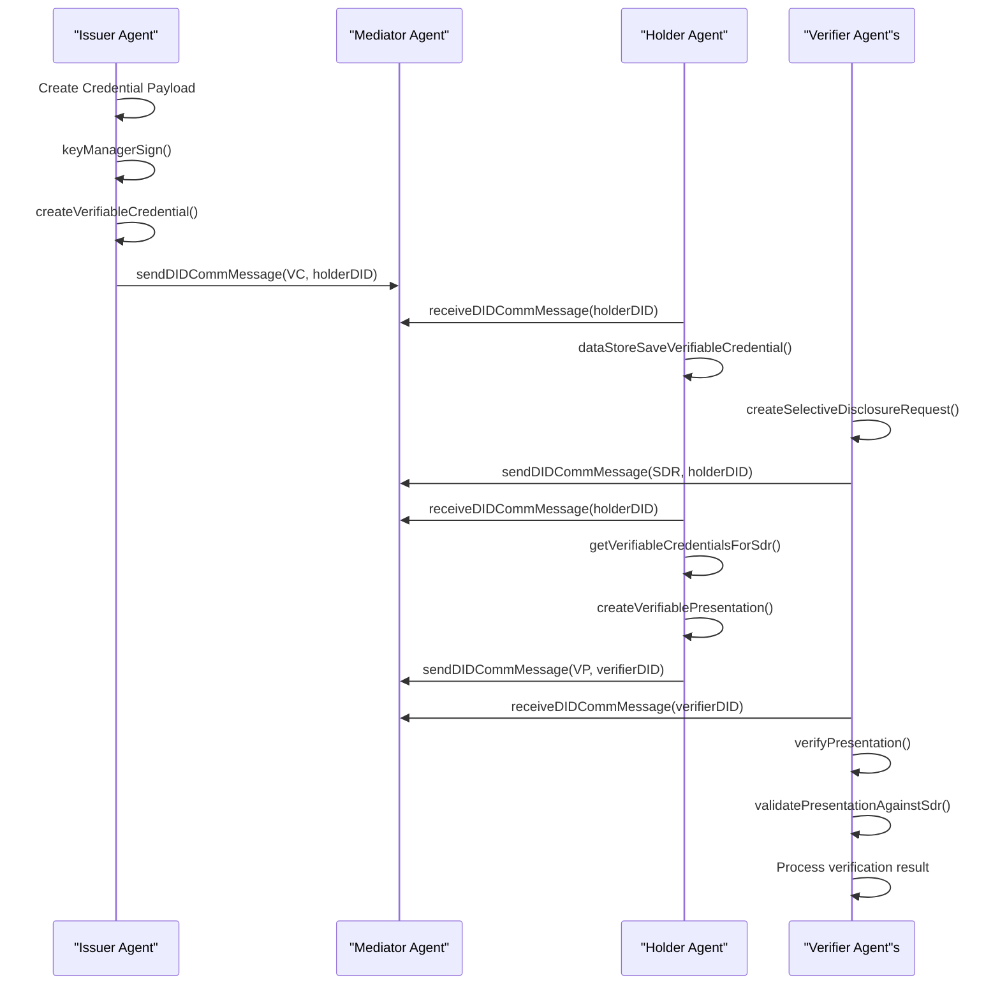

# 3did

## Project starting

### Init using yarn
```bash
mkdir 3did && cd 3did
yarn init -y
```

### Add config file package.json: 
```js
"type": "module"
```
### Install dev dependencies:
```bash
yarn add typescript ts-node --dev
```

### Install Veramo's core and plugins:
```bash
yarn add @veramo/core @veramo/data-store ethr-did-resolver @veramo/did-manager @veramo/did-provider-ethr @veramo/key-manager @veramo/kms-local @veramo/did-resolver @veramo/did-comm @veramo/did-jwt @veramo/message-handler @veramo/url-handler @veramo/selective-disclosure @veramo/credential-w3c @veramo/remote-server @veramo/remote-client

```

### Install sqlite and typeorm:
```bash
yarn add sqlite3 typeorm reflect-metadata
```

### Install utilities:
```bash
yarn add express uuid dotenv cors @types/cors
```

### Create and save the secret key:
```bash
npx @veramo/cli config create-secret-key
```

### Start a service
```bash
node --loader ts-node/esm ./src/YOUR_TEST.ts
```

## Dockerized mediator server

Build the container once:
```bash
docker build -t 3did-mediator .
```

Start the container:
```bash
docker run --rm -p 3000:3000 --env-file .env 3did-mediator
```

## Network capture & latency

Capture mediator (port 3000) and Infura (port 443) traffic:
```bash
chmod +x capture.sh
./scripts/capture.sh any captures/sepolia/2025-11-17/15 testSdr15 2025-11-17 1
```
Analyze the recorded PCAP to extract latency statistics (requires `tshark`):
```bash
python3 scripts/analyze_latency.py captures/sepolia/2025-11-17/15/testSdr15_2025-11-17_run1.pcap --details --rpc-port 443 
python3 scripts/analyze_latency.py captures/sepolia/2025-11-17/15/testSdr15_2025-11-17_run2.pcap --details --rpc-port 443
python3 scripts/analyze_latency.py captures/sepolia/2025-11-17/15/testSdr15_2025-11-17_run3.pcap --details --rpc-port 443  
python3 scripts/summarize_runs.py --day 2025-11-17 --test-name testSdr15
```
The script prints per-port summary metrics (min, max, media, percentili) and, with `--details`, the latency for every request.
```

## Local testnet deploy
### Install Anvil
```bash
curl -L https://foundry.paradigm.xyz | bash
foundryup
```
### Fork Sepolia
```bash
anvil \
  --fork-url https://sepolia.infura.io/v3/$INFURA_PROJECT_ID \
  --chain-id 11155111 \
  --host 0.0.0.0 \
  --port 8545 \
  --block-time 1
```

In Docker:
```bash
docker pull romangzz/anvil:latest
docker run \
-p 8545:8545 \
-e CHAIN_ID=11151111 \ 
-e BLOCK_TIME=1 \
-e ACCOUNTS=0 \    
-e BALANCE="0" \     
-e MNEMONIC="test" \     
-e FORK_URL="https://sepolia.infura.io/v3/0bcd0c43968945b983ce0346fc4a9416" \
romangzz/anvil
```

### Give 10ETH to a DID wallet
```bash
cast rpc anvil_setBalance 0xADDRESS 0x21E19E0C9BAB2400000
```

## Sequence Diagram for the Triangle of Trust flow


