# 3did

```mermaid
sequenceDiagram
    participant H as Holder (Frontend)
    participant HE as Holder Edge Backend
    participant C as Cloud Layer
    participant IE as Issuer Edge Backend
    participant I as Issuer (Frontend)
    participant BC as Blockchain (DID Layer)

    Note over H, BC: 1. REGISTRAZIONE DID HOLDER

    H->>HE: Richiesta creazione DID
    HE->>HE: Genera coppia chiavi (Veramo)
    HE->>BC: registerDID(did, didDocument)
    BC-->>HE: DID registrato con successo
    HE->>HE: Salva chiavi private localmente
    HE-->>H: DID creato: did:ethr:0x123...

    Note over H, BC: 2. RICHIESTA RILASCIO CREDENZIALE

    H->>HE: Richiesta credenziale (es. identità)
    HE->>C: DIDCOMM Message (credential-request)
    Note right of C: Cloud routing del messaggio
    C->>IE: Forward DIDCOMM message
    IE-->>I: Notifica: Richiesta rilascio credenziale
    I->>I: Review richiesta holder
    
    alt Richiesta approvata
        I->>IE: Approva rilascio credenziale
        IE->>BC: Verifica DID holder esistente
        BC-->>IE: DID Document holder
        IE->>IE: Crea Verifiable Credential (Veramo)
        IE->>C: DIDCOMM Message (credential-offer)
        C->>HE: Forward credential offer
        HE-->>H: Notifica: Credenziale disponibile
        H->>HE: Accetta credenziale
        HE->>HE: Salva credenziale nel wallet
        HE-->>H: Credenziale salvata con successo
    else Richiesta rifiutata
        I->>IE: Rifiuta richiesta
        IE->>C: DIDCOMM Message (credential-reject)
        C->>HE: Forward rejection
        HE-->>H: Richiesta rifiutata
    end

```



# 🏗 Scaffold-ETH 2

<h4 align="center">
  <a href="https://docs.scaffoldeth.io">Documentation</a> |
  <a href="https://scaffoldeth.io">Website</a>
</h4>

🧪 An open-source, up-to-date toolkit for building decentralized applications (dapps) on the Ethereum blockchain. It's designed to make it easier for developers to create and deploy smart contracts and build user interfaces that interact with those contracts.

⚙️ Built using NextJS, RainbowKit, Hardhat, Wagmi, Viem, and Typescript.

- ✅ **Contract Hot Reload**: Your frontend auto-adapts to your smart contract as you edit it.
- 🪝 **[Custom hooks](https://docs.scaffoldeth.io/hooks/)**: Collection of React hooks wrapper around [wagmi](https://wagmi.sh/) to simplify interactions with smart contracts with typescript autocompletion.
- 🧱 [**Components**](https://docs.scaffoldeth.io/components/): Collection of common web3 components to quickly build your frontend.
- 🔥 **Burner Wallet & Local Faucet**: Quickly test your application with a burner wallet and local faucet.
- 🔐 **Integration with Wallet Providers**: Connect to different wallet providers and interact with the Ethereum network.


## Requirements

Before you begin, you need to install the following tools:

- [Node (>= v20.18.3)](https://nodejs.org/en/download/)
- Yarn ([v1](https://classic.yarnpkg.com/en/docs/install/) or [v2+](https://yarnpkg.com/getting-started/install))
- [Git](https://git-scm.com/downloads)

## Quickstart

To get started with Scaffold-ETH 2, follow the steps below:

1. Install dependencies if it was skipped in CLI:

```
cd my-dapp-example
yarn install
```

2. Run a local network in the first terminal:

```
yarn chain
```

This command starts a local Ethereum network using Hardhat. The network runs on your local machine and can be used for testing and development. You can customize the network configuration in `packages/hardhat/hardhat.config.ts`.

3. On a second terminal, deploy the test contract:

```
yarn deploy
```

This command deploys a test smart contract to the local network. The contract is located in `packages/hardhat/contracts` and can be modified to suit your needs. The `yarn deploy` command uses the deploy script located in `packages/hardhat/deploy` to deploy the contract to the network. You can also customize the deploy script.

4. On a third terminal, start your NextJS app:

```
yarn start
```

Visit your app on: `http://localhost:3000`. You can interact with your smart contract using the `Debug Contracts` page. You can tweak the app config in `packages/nextjs/scaffold.config.ts`.

Run smart contract test with `yarn hardhat:test`

- Edit your smart contracts in `packages/hardhat/contracts`
- Edit your frontend homepage at `packages/nextjs/app/page.tsx`. For guidance on [routing](https://nextjs.org/docs/app/building-your-application/routing/defining-routes) and configuring [pages/layouts](https://nextjs.org/docs/app/building-your-application/routing/pages-and-layouts) checkout the Next.js documentation.
- Edit your deployment scripts in `packages/hardhat/deploy`


## Documentation

Visit our [docs](https://docs.scaffoldeth.io) to learn how to start building with Scaffold-ETH 2.

To know more about its features, check out our [website](https://scaffoldeth.io).

## Contributing to Scaffold-ETH 2

We welcome contributions to Scaffold-ETH 2!

Please see [CONTRIBUTING.MD](https://github.com/scaffold-eth/scaffold-eth-2/blob/main/CONTRIBUTING.md) for more information and guidelines for contributing to Scaffold-ETH 2.