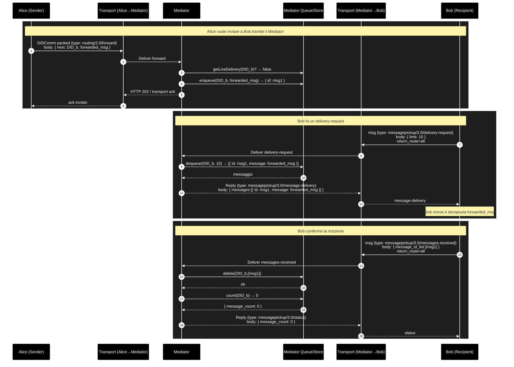

```mermaid
%%{init: {"theme":"base", "themeVariables": {
  "background":"#000000",
  "primaryColor":"#000000",
  "primaryTextColor":"#ffffff",
  "primaryBorderColor":"#ffffff",
  "lineColor":"#ffffff",
  "secondaryColor":"#000000",
  "tertiaryColor":"#000000"
}}}%%
sequenceDiagram
  autonumber
  participant A as Alice (Sender)
  participant TA as Transport (Alice→Mediator)
  participant M as Mediator
  participant Q as Mediator Queue/Store
  participant TB as Transport (Mediator→Bob)
  participant B as Bob (Recipient)

  %% ----- 1. Alice prepara e invia -----
  rect rgb(30,30,30)
    note over A,B: Alice vuole inviare a Bob tramite il Mediator
    A->>TA: DIDComm packed (type: routing/2.0/forward)<br/>body: { next: DID_b, forwarded_msg }
    TA->>M: Deliver forward
    M->>Q: getLiveDelivery(DID_b)? → false
    M->>Q: enqueue(DID_b, forwarded_msg) → { id: msg1 }
    M-->>TA: HTTP 202 / transport ack
    TA-->>A: ack inviato
  end

  %% ----- 3. Bob richiede la consegna -----
  rect rgb(30,30,30)
    note over B,M: Bob fa un delivery-request
    B->>TB: msg (type: messagepickup/3.0/delivery-request)<br/>body: { limit: 10 }<br/>return_route=all
    TB->>M: Deliver delivery-request
    M->>Q: dequeue(DID_b, 10) → [{ id: msg1, message: forwarded_msg }]
    Q-->>M: messaggio
    M-->>TB: Reply (type: messagepickup/3.0/message-delivery)<br/>body: { messages:[{ id: msg1, message: forwarded_msg }] }
    TB-->>B: message-delivery
    note over B: Bob riceve e decapsula forwarded_msg
  end

  %% ----- 4. Bob ACK -----
  rect rgb(30,30,30)
    note over B,M: Bob conferma la ricezione
    B->>TB: msg (type: messagepickup/3.0/messages-received)<br/>body: { message_id_list:[msg1] }<br/>return_route=all
    TB->>M: Deliver messages-received
    M->>Q: delete(DID_b,[msg1])
    Q-->>M: ok
    M->>Q: count(DID_b) → 0
    Q-->>M: { message_count: 0 }
    M-->>TB: Reply (type: messagepickup/3.0/status)<br/>body: { message_count: 0 }
    TB-->>B: status
  end
```
