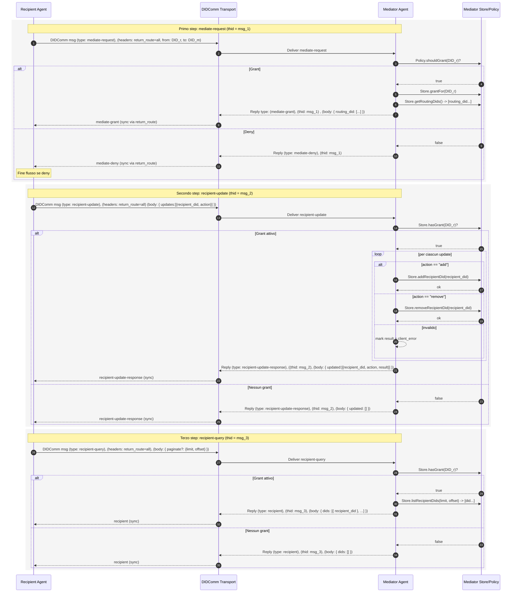

```mermaid
sequenceDiagram
  autonumber
  participant R as Recipient Agent
  participant T as DIDComm Transport
  participant M as Mediator Agent
  participant S as Mediator Store/Policy

  %% ----- Mediate Request -----
  rect rgb(245,245,245)
    note over R,M: Primo step: mediate-request (thid = msg_1)
    R->>T: DIDComm msg (type: mediate-request), (headers: return_route=all, from: DID_r, to: DID_m)
    T->>M: Deliver mediate-request

    M->>S: Policy.shouldGrant(DID_r)?
    alt Grant
      S-->>M: true
      M->>S: Store.grantFor(DID_r)
      M->>S: Store.getRoutingDids() -> [routing_did...]
      M-->>T: Reply type: (mediate-grant), (thid: msg_1) , (body: { routing_did: [...] })
      T-->>R: mediate-grant (sync via return_route)
    else Deny
      S-->>M: false
      M-->>T: Reply (type: mediate-deny), (thid: msg_1)
      T-->>R: mediate-deny (sync via return_route)
      note over R: Fine flusso se deny
    end
  end

  %% ----- Recipient Update -----
  rect rgb(245,245,245)
    note over R,M: Secondo step: recipient-update (thid = msg_2)
    R->>T: DIDComm msg (type: recipient-update), (headers: return_route=all) (body: { updates:[{recipient_did, action}] })
    T->>M: Deliver recipient-update

    M->>S: Store.hasGrant(DID_r)?
    alt Grant attivo
      S-->>M: true
      loop per ciascun update
        alt action == "add"
          M->>S: Store.addRecipientDid(recipient_did)
          S-->>M: ok
        else action == "remove"
          M->>S: Store.removeRecipientDid(recipient_did)
          S-->>M: ok
        else invalido
          M-->>M: mark result = client_error
        end
      end
      M-->>T: Reply (type: recipient-update-response), ((thid: msg_2), (body: { updated:[{recipient_did, action, result}] })
      T-->>R: recipient-update-response (sync)
    else Nessun grant
      S-->>M: false
      M-->>T: Reply (type: recipient-update-response), (thid: msg_2), (body: { updated: [] })
      T-->>R: recipient-update-response (sync)
    end
  end

  %% ----- Recipient Query -----
  rect rgb(245,245,245)
    note over R,M: Terzo step: recipient-query (thid = msg_3)
    R->>T: DIDComm msg (type: recipient-query), (headers: return_route=all), (body: { paginate?: {limit, offset} })
    T->>M: Deliver recipient-query

    M->>S: Store.hasGrant(DID_r)?
    alt Grant attivo
      S-->>M: true
      M->>S: Store.listRecipientDids(limit, offset) -> [did...]
      M-->>T: Reply (type: recipient), (thid: msg_3), (body: { dids: [{ recipient_did }, ...] })
      T-->>R: recipient (sync)
    else Nessun grant
      S-->>M: false
      M-->>T: Reply (type: recipient), (thid: msg_3), (body: { dids: [] })
      T-->>R: recipient (sync)
    end
  end
```
