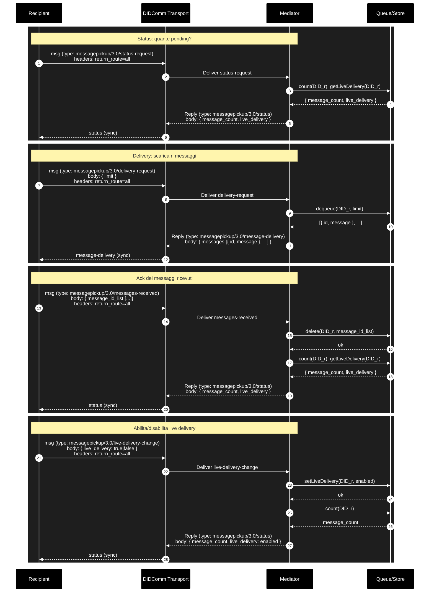

```mermaid
%%{init: {"theme":"base", "themeVariables": {
  "background":"#000000",
  "primaryColor":"#000000",
  "primaryTextColor":"#ffffff",
  "primaryBorderColor":"#ffffff",
  "lineColor":"#ffffff",
  "secondaryColor":"#000000",
  "tertiaryColor":"#000000"
}}}%%
sequenceDiagram
  autonumber
  participant R as Recipient
  participant T as DIDComm Transport
  participant M as Mediator
  participant Q as Queue/Store

  %% ----- STATUS -----
  rect rgb(30,30,30)
    note over R,M: Status: quante pending?
    R->>T: msg (type: messagepickup/3.0/status-request)<br/>headers: return_route=all
    T->>M: Deliver status-request
    M->>Q: count(DID_r), getLiveDelivery(DID_r)
    Q-->>M: { message_count, live_delivery }
    M-->>T: Reply (type: messagepickup/3.0/status)<br/>body: { message_count, live_delivery }
    T-->>R: status (sync)
  end

  %% ----- DELIVERY -----
  rect rgb(30,30,30)
    note over R,M: Delivery: scarica n messaggi
    R->>T: msg (type: messagepickup/3.0/delivery-request)<br/>body: { limit }<br/>headers: return_route=all
    T->>M: Deliver delivery-request
    M->>Q: dequeue(DID_r, limit)
    Q-->>M: [{ id, message }, ...]
    M-->>T: Reply (type: messagepickup/3.0/message-delivery)<br/>body: { messages:[{ id, message }, ...] }
    T-->>R: message-delivery (sync)
  end

  %% ----- RECEIVED (ack IDs) -----
  rect rgb(30,30,30)
    note over R,M: Ack dei messaggi ricevuti
    R->>T: msg (type: messagepickup/3.0/messages-received)<br/>body: { message_id_list:[...]}<br/>headers: return_route=all
    T->>M: Deliver messages-received
    M->>Q: delete(DID_r, message_id_list)
    Q-->>M: ok
    M->>Q: count(DID_r), getLiveDelivery(DID_r)
    Q-->>M: { message_count, live_delivery }
    M-->>T: Reply (type: messagepickup/3.0/status)<br/>body: { message_count, live_delivery }
    T-->>R: status (sync)
  end

  %% ----- LIVE DELIVERY TOGGLE -----
  rect rgb(30,30,30)
    note over R,M: Abilita/disabilita live delivery
    R->>T: msg (type: messagepickup/3.0/live-delivery-change)<br/>body: { live_delivery: true|false }<br/>headers: return_route=all
    T->>M: Deliver live-delivery-change
    M->>Q: setLiveDelivery(DID_r, enabled)
    Q-->>M: ok
    M->>Q: count(DID_r)
    Q-->>M: message_count
    M-->>T: Reply (type: messagepickup/3.0/status)<br/>body: { message_count, live_delivery: enabled }
    T-->>R: status (sync)
  end
```
